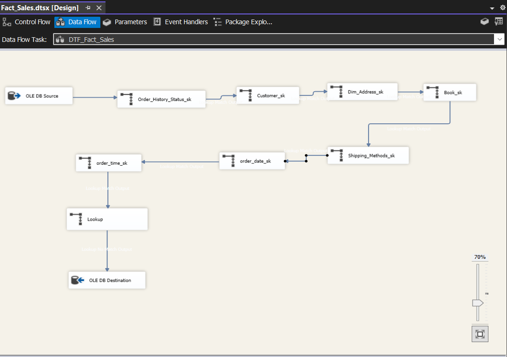
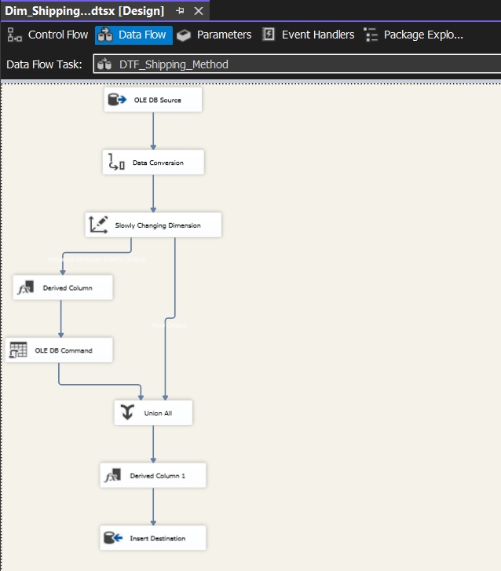
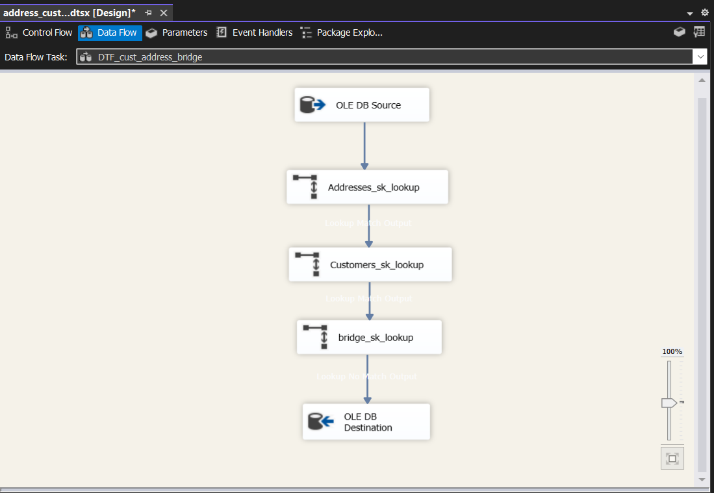
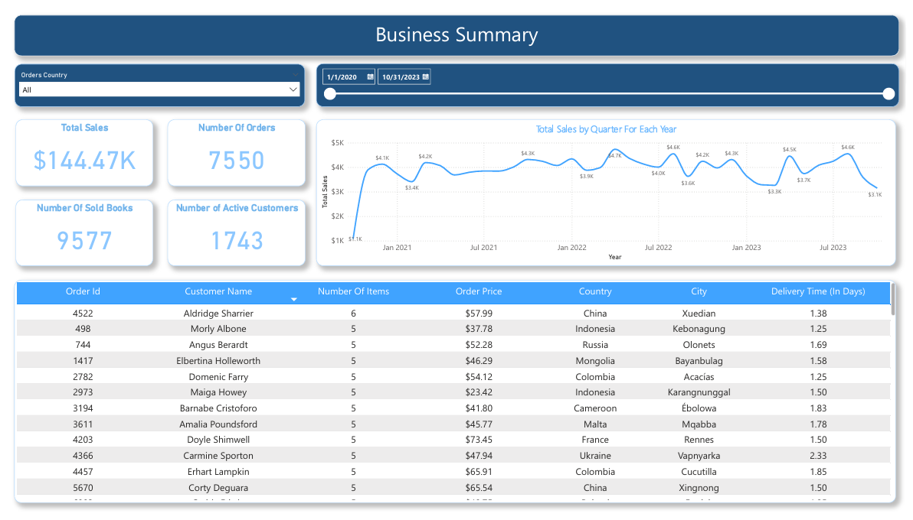
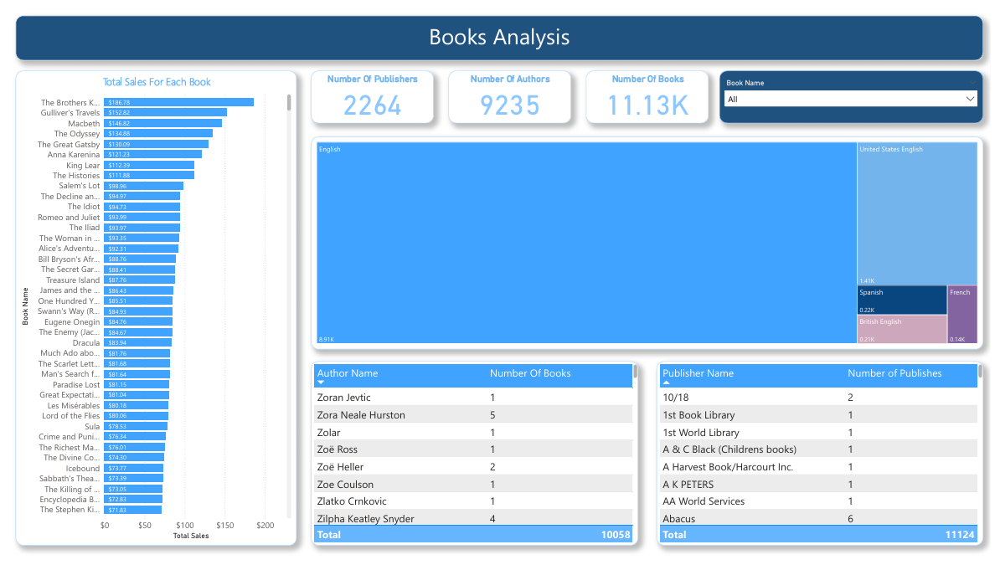
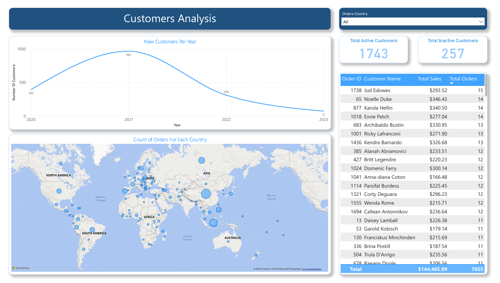
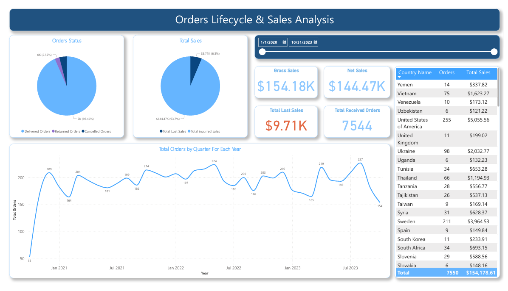
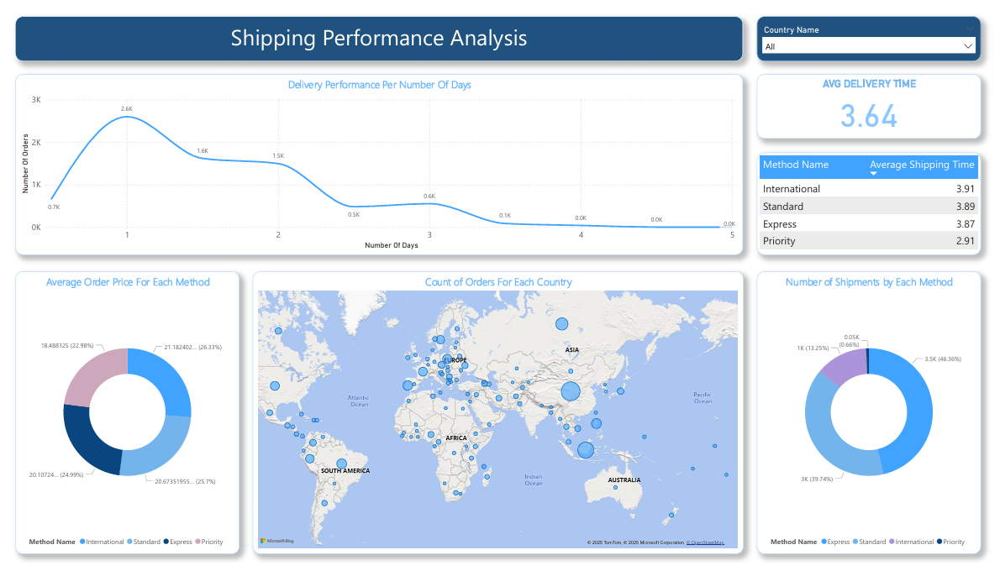

# SSIS-Data-Warehouse-ETL-Pipeline

# Table of Contents

1. [Description](#description)  
2. [Tech Stack](#tech-stack)  
3. [Folder Structure](#folder-structure)  
4. [Project Architecture](#project-architecture)  
5. [How to Run the Project](#how-to-run-the-project)  
6. [Notes](#notes)  
7. [SSIS ETL Structure](#ssis-etl-structure)  
   - [1️⃣ Source (Extract)](#1️⃣-source-extract)  
   - [2️⃣ Transformations](#2️⃣-transformations)  
   - [3️⃣ Destination (Load)](#3️⃣-destination-load)  
   - [Fact_Sales fact Data Flow](#fact_sales-fact-data-flow)  
   - [Shipping Methods Dimension Data Flow](#shipping-methods-dimension-data-flow)  
   - [Customer Address Bridge Table Data Flow](#customer-address-bridge-table-data-flow)  
9. [SQL Explorations and Transformations](#sql-explorations-and-transformations)  
   - [1️⃣ Calculating the average shipping time for each order](#1️⃣-calculating-the-average-shipping-time-for-each-order)  
   - [2️⃣ Retrieving All Foreign Keys for each dimension to load into the DWH](#2️⃣-retrieving-all-foreign-keys-for-each-dimension-to-load-into-the-dwh)  
   - [3️⃣ Selecting Cancelled Orders](#3️⃣-selecting-cancelled-orders)  
   - [4️⃣ Selecting New Customers for each year](#4️⃣-selecting-new-customers-for-each-year)  
10. [Reporting](#reporting)  
    - [Sales Dashboard Report (2020-2023)](#sales-dashboard-report-2020-2023)  
    - [Business Summary Dashboard](#business-summary-dashboard)  
    - [Books Analysis Dashboard](#books-analysis-dashboard)  
    - [Customers Analysis Dashboard](#customers-analysis-dashboard)  
    - [Orders Lifecycle & Sales Analysis Dashboard](#orders-lifecycle--sales-analysis-dashboard)  
    - [Shipping Performance Analysis Dashboard](#shipping-performance-analysis-dashboard)  


## Description
This project showcases an end-to-end ETL pipeline using SQL Server Integration Services (SSIS) that extracts, transforms, and loads data from an OLTP database into a star schema data warehouse.  To efficiently track changes, an incremental load mechanism is built, and business reporting is done using a Power BI dashboard.

## Tech Stack
* **SQL Server** OLTP + DWH system
* **Power BI** for reporting and KPIs
* **SSIS** for ETL pipelines
* **Git & GitHub** for version control

---

## Folder Structure
```
SSIS-Data-Warehouse-ETL-Pipeline/
├── SSIS-Packages/
│   └── Packages
|   └── Fact_Sales.dtsx
├── SQL/
│   ├── DWH_Tables_DDL.sql
│   ├── Dim_Date.sql
│   └── Dim_Time.sql
├── Database/
│   └── gravity_books.sql
│   └── Gravity_DWH.sql
├── Reports/
│   └── Gravity Library Summary.pdf
└── README.md
```

---

## Project Architecture

1. **Source**: Normalized OLTP (gravity books)  


* `Address` - Stores customer and order shipping addresses
* `Address Status` - Status of a customer’s address (e.g., active, inactive)
* `Author` - Information about book authors
* `Book` - Information about books available in the store
* `Book Author` - Relationship between books and their authors
* `Book Language` - Supported languages for books
* `Country` - List of countries for addresses and customers
* `Customer` - Customers who purchase books
* `Customer Address` - Relationship between customers and their addresses
* `Customer Order` - Orders placed by customers
* `Order History` - Status history of customer orders
* `Order Line` - Line items within each customer order
* `Order Status` - Possible statuses of an order (e.g., pending, shipped)
* `Publisher` - Information about book publishers
* `Shipping Method` - Available shipping methods and their costs

2. **SSIS ETL Process**:

   * Incremental Loads
   * Lookup transformations for foreign keys
   * Slowly changing components for the Address dimension
   * Updated logs for ETL Process start and end for each package
3. **Snowflake Schema Design**:

   * Fact Table: `Fact_Sales`
   * Dimension Tables: `address_customer_bridge`, `bridge_book_author`, `Dim_Authors`, `Dim_Addresses`, `Dim_Books`, `Dim_Customers`, `Dim_order_history`, `Dim_shipping_methods`, `Dim_Date`, `Dim_Time`
     ## OLAP Diagram Overview
          

4. **Power BI Dashboard**:
   * `Measures`: Gross Sales, Total Orders without cancelled and returned, Total Lost Sales, 
   * `Calculated Tables`: Average_Shipping_Time, Estimated_Delivery_Time
   * `KPIs`: Return Rate (%), Avg Delivery Time, Net Sales   
   
---

## How to Run the Project

1. **Restore Databases**
   - Restore the **OLTP** and **DW** databases from backup files or scripts.

2. **Open ETL Package**
   - Launch **Visual Studio (SQL Server Data Tools)**.
   - Open the file: `gravity.sln`.

3. **Configure Connections**
   - Check and update your **database connection strings**.

4. **Run ETL Tasks**
   - `ETL-Execution-Log` will be overwritten by the new ETL execution date.
   - Run **Fact** and **Address** data flows.
   - Update the `ETL-Execution-Log` table.

5. **Refresh Dashboard**
   - Open the **Power BI dashboard**.
   - Refresh the dataset to view the updated data.
     
## Notes
- Ensure the backup files or scripts are available before starting.
- Verify all connection strings in Visual Studio before execution.
- Power BI refresh might take a few minutes depending on dataset size.

---

## SSIS ETL Structure

The ETL pipeline is built using **SQL Server Integration Services (SSIS)** and extracts data from an **OLTP SQL Server Database**, applies transformations to prepare it for analytical use, and loads it into a **SQL Server Data Warehouse (DWH)**.

### 1️⃣ Source (Extract)
- **OLTP SQL Server Database**  
  - Orders, Customers, and related transactional data.  
  - Provides raw operational data that needs to be transformed before analytics.  

### 2️⃣ Transformations
- **Derived Columns**  
  - Example: Splitting `status_date` (originally a timestamp) into separate **Date** and **Time** columns for easier reporting and analysis.  
- **Lookups**  
  - Replacing **OLTP foreign keys** with **surrogate keys** from dimension tables in the DWH (e.g., mapping `customer_id` or `product_id` to the corresponding surrogate keys).  
- **Data Standardization**  
  - Ensuring consistent formats and applying business rules.  

### 3️⃣ Destination (Load)
- **SQL Server Data Warehouse (DWH)**  
  - Structured into **Fact** and **Dimension** tables.  
  - Supports reporting tools (e.g., Power BI) for analytics and dashboarding.  

### Examples

### Fact_Sales fact Data Flow


### Shipping Methods Dimension Data Flow


### Customer Address Bridge Table Data Flow


---

## SQL Explorations and Transformations

### 1️⃣ Calculating the average shipping time for each order
This query calculates the average delivery time per order by combining the day and time differences between the order date/time and its status update. Results include order details (ID, customer, shipping method, cost) and return the rounded delivery duration for performance analysis.

```sql
SELECT   
    fs.order_id_bk_dd,    
    sm.method_name,
    fs.customer_id_fk,
    sm.cost,
    ROUND(
    AVG(
        CASE 
            WHEN DATEDIFF(DAY, dd.Date, oh.status_date) = 0 
            THEN 1
            ELSE DATEDIFF(DAY, dd.Date, oh.status_date)
        END
        + (
            ROUND(CAST(DATEDIFF(SECOND, CAST('00:00:00' AS TIME), oh.status_time) AS FLOAT) / 86400.0, 4)
            - ROUND(CAST(DATEDIFF(SECOND, CAST('00:00:00' AS TIME), dt.time) AS FLOAT) / 86400.0, 4)
          )
    ), 2
) AS average_time  
FROM Fact_sales AS fs
JOIN Dim_order_history AS od
    ON fs.history_id_fk = od.history_id_sk
JOIN Dim_Date as dd
    ON fs.date_id_fk = dd.Date_SK
JOIN Dim_Time as dt
    ON fs.time_id_fk = dt.Time_SK
JOIN Dim_order_history oh
    ON fs.history_id_fk = oh.history_id_sk
JOIN Dim_shipping_methods as sm
    ON fs.shipping_method_fk = sm.method_id_sk
group by fs.order_id_bk_dd, sm.method_name, sm.cost, fs.customer_id_fk
order by fs.order_id_bk_dd
```

### 2️⃣ Retrieving All Foreign Keys for each dimension to load into the DWH
This query retrieves the necessary foreign keys from the source tables to prepare for dimension mapping. It extracts order-level information (order, customer, shipping method, address, history, book, and order line details), along with a split of the order date into separate date and time fields.

```sql
SELECT
    co.order_id,
    sm.method_id,
    co.dest_address_id,
	ISNULL(oh.history_id, 99999) as history_id ,
    c.customer_id,
    b.book_id,
	CAST([order_date] AS DATE) AS splitted_order_date,
	CAST([order_date] AS TIME(0)) AS splitted_order_time,
    ol.price
FROM cust_order AS co
LEFT JOIN shipping_method AS sm
ON co.shipping_method_id = sm.method_id
LEFT JOIN order_history AS oh
ON co.order_id = oh.order_id
LEFT JOIN customer AS c
ON co.customer_id = c.customer_id
LEFT JOIN order_line AS ol
ON co.order_id = ol.order_id
LEFT JOIN book AS b
ON ol.book_id = b.book_id
```

### 3️⃣ Selecting Cancelled Orders
This query retrieves all cancelled orders that were previously marked as received, returning the order ID and the total number of items per order.

```sql
SELECT     	
	fs.order_id_bk_dd,
	count(history_id_sk) as total_items
FROM Fact_sales AS fs
LEFT JOIN Dim_order_history AS od
    ON fs.history_id_fk = od.history_id_sk
LEFT JOIN Dim_shipping_methods AS sm
    ON fs.shipping_method_fk = sm.method_id_sk
WHERE od.status_value = 'Cancelled' 
  AND EXISTS (
        SELECT 1
        FROM Fact_sales fs2
        LEFT JOIN Dim_order_history od2
            ON fs2.history_id_fk = od2.history_id_sk
        WHERE fs2.order_id_bk_dd = fs.order_id_bk_dd
          AND od2.status_value = 'Order Received'
  )
group by fs.order_id_bk_dd
```

### 4️⃣ Selecting New Customers for each year
This query determines the first year each customer placed an order and then counts the number of new customers per year.

``` sql
SELECT 
    FirstOrders.First_Year AS Year,
    COUNT(DISTINCT FirstOrders.customer_id_fk) AS total_new_customers
FROM (
    SELECT 
        fs.customer_id_fk,
        MIN(dd.Year) AS First_Year
    FROM Fact_sales fs
    LEFT JOIN Dim_Date dd 
        ON fs.date_id_fk = dd.Date_SK
    LEFT JOIN Dim_order_history od
        ON fs.history_id_fk = od.history_id_sk    
    GROUP BY fs.customer_id_fk
) AS FirstOrders
GROUP BY FirstOrders.First_Year;
```

---

## Reporting

### Sales Dashboard Report (2020-2023)
Overview: The Gravity Book Library dashboard summarizes sales performance from 2020 to 2023, with total revenue of $144.47K from 1.7K customers.
  -	Top Markets: China ($28K) and Indonesia ($20K) show strong purchasing power, reflecting high customer purchasing power.  
  -	Demographics: East Asia leads the sales with the largest segment (44%), driving significant sales.
  -	Categories: English Books lead sales, while French books lag, indicating underperformance.
  -	Financial Performance: Total sales reached $154.18K, of which $9.71K (6.3%) were lost due to cancelled or returned orders — a ratio that is within the normal      industry range and generally considered healthy.

### Business Summary Dashboard


### Books Analysis Dashboard


### Customers Analysis Dashboard


### Orders Lifecycle & Sales Analysis Dashboard


### Shipping Performance Analysis Dashboard


If you have any questions or need clarification on anything in the project, feel free to reach out! I'd be more than happy to help and would love to assist you with any queries.
